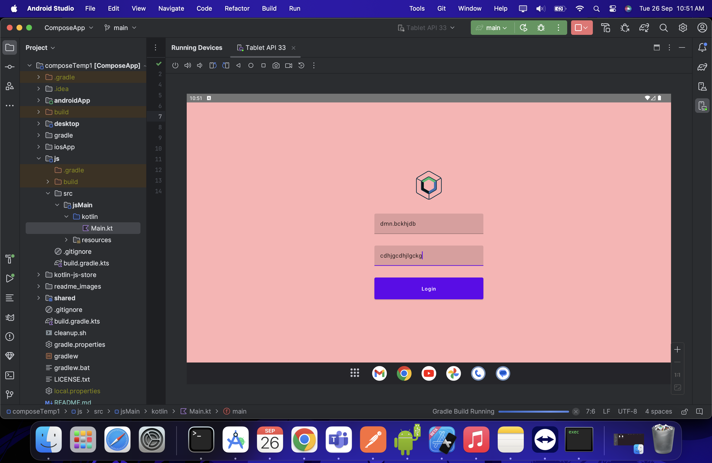
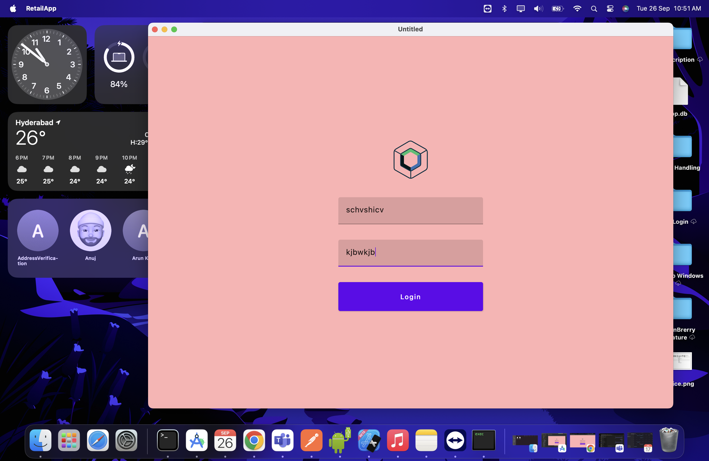
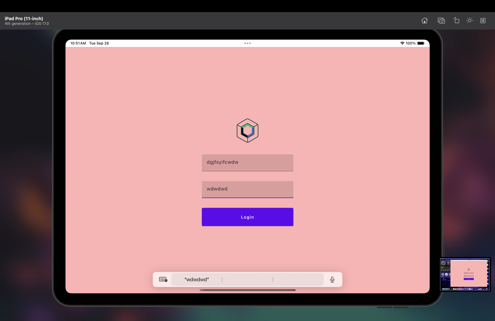
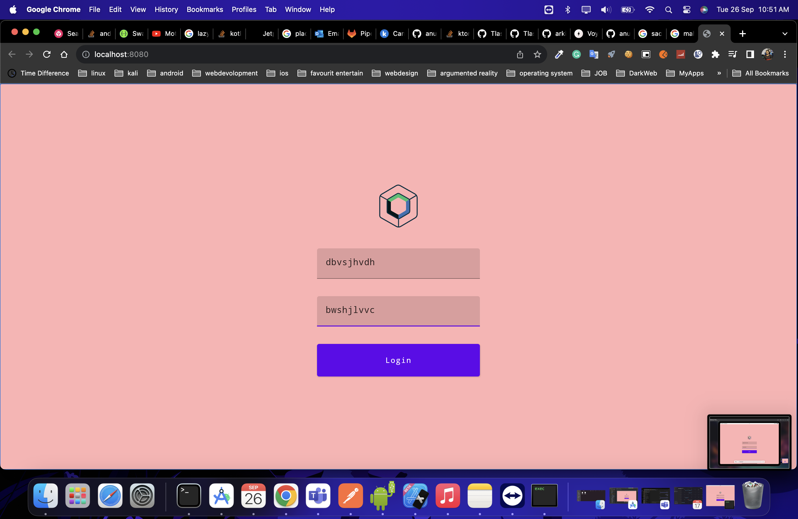

# [Compose Multiplatform](https://github.com/JetBrains/compose-multiplatform) navigation in KMP application

> **Note**
> Compose Multiplatform for iOS is in Alpha. It may change incompatibly and require manual migration in the future.
> We would appreciate your feedback on it in the public Slack channel [#compose-ios](https://kotlinlang.slack.com/archives/C0346LWVBJ4/p1678888063176359).
> If you have any issues, please report them on [GitHub](https://github.com/JetBrains/compose-multiplatform/issues).

You can use this template to start developing your own [Compose Multiplatform](https://github.com/JetBrains/compose-multiplatform#readme) mobile application targeting Android and iOS.
Follow our tutorial below to get your first Compose Multiplatform app up and running.
The result will be a [Kotlin Multiplatform](https://kotlinlang.org/docs/multiplatform.html) project that uses the Compose Multiplatform UI framework.

Android

Desktop

IOS

Web

This Template Include All platform (Android/IOS/Desktop/Web) –
use the [Compose Multiplatform desktop application template](https://github.com/JetBrains/compose-multiplatform-desktop-template#readme).

## Set up the environment

> **Warning**
> You need a Mac with macOS to write and run iOS-specific code on simulated or real devices.
> This is an Apple requirement.

To work with this template, you need the following:

* A machine running a recent version of macOS
* [Xcode](https://apps.apple.com/us/app/xcode/id497799835)
* [Android Studio](https://developer.android.com/studio)
* The [Kotlin Multiplatform Mobile plugin](https://plugins.jetbrains.com/plugin/14936-kotlin-multiplatform-mobile)
* The [CocoaPods dependency manager](https://kotlinlang.org/docs/native-cocoapods.html)

### Check your environment

Before you start, use the [KDoctor](https://github.com/Kotlin/kdoctor) tool to ensure that your development environment is configured correctly:

 advanced Compose Multiplatform example projects](https://github.com/JetBrains/compose-multiplatform/blob/master/examples/README.md)
 

### Navigation in KMP

